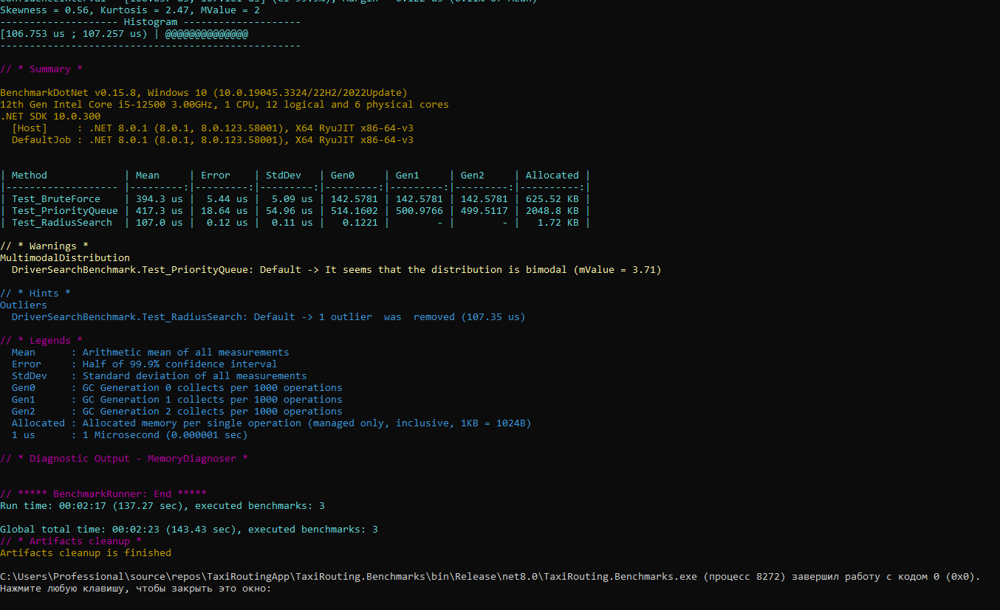

Подбор водителей для такси на C#

Проект реализует поиск 5 ближайших водителей к заказу на сетке N*M. 

Алгоритмы:
1. BruteForceSearch (Полный перебор) — сканирует всех водителей, вычисляет расстояние через LINQ и сортирует весь массив. 
2. PriorityQueueSearch (Очередь с приоритетом) — использует структуру данных `PriorityQueue`. 
3. RadiusSearch (Поиск в радиусе) — сначала ищет водителей в небольшом квадрате вокруг заказа и расширяет зону поиска только при нехватке результатов.

Результаты сравнения производительности (BenchmarkDotNet):

Ниже представлен скриншот результатов тестирования производительности на выборке из 20 000 случайных водителей:

Вывод:
Алгоритм RadiusSearch показал наилучшую скорость выполнения, так как он отсекает лишние вычисления расстояний для водителей, находящихся на другом конце карты.
